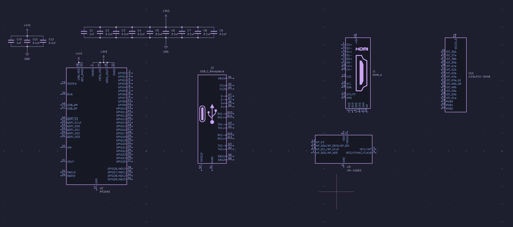
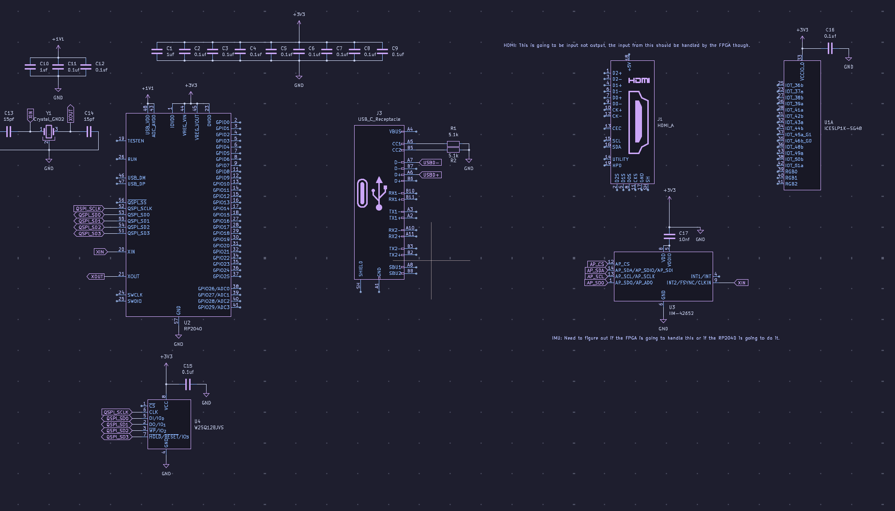
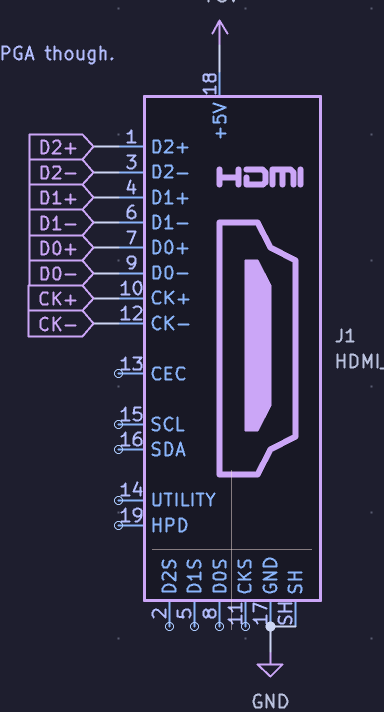
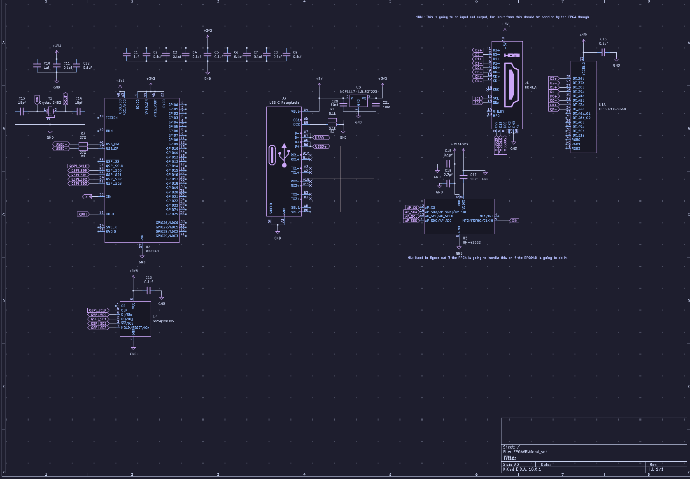
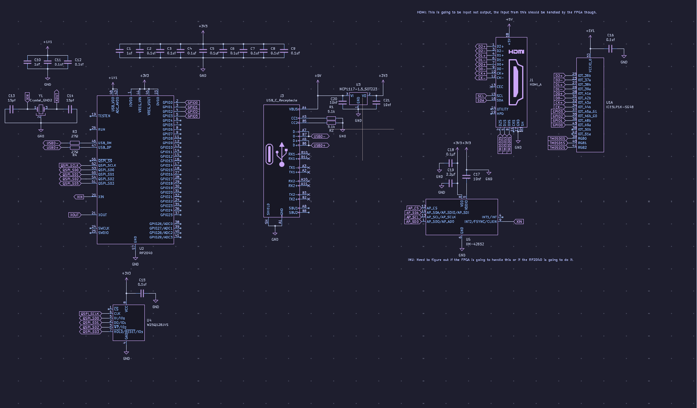
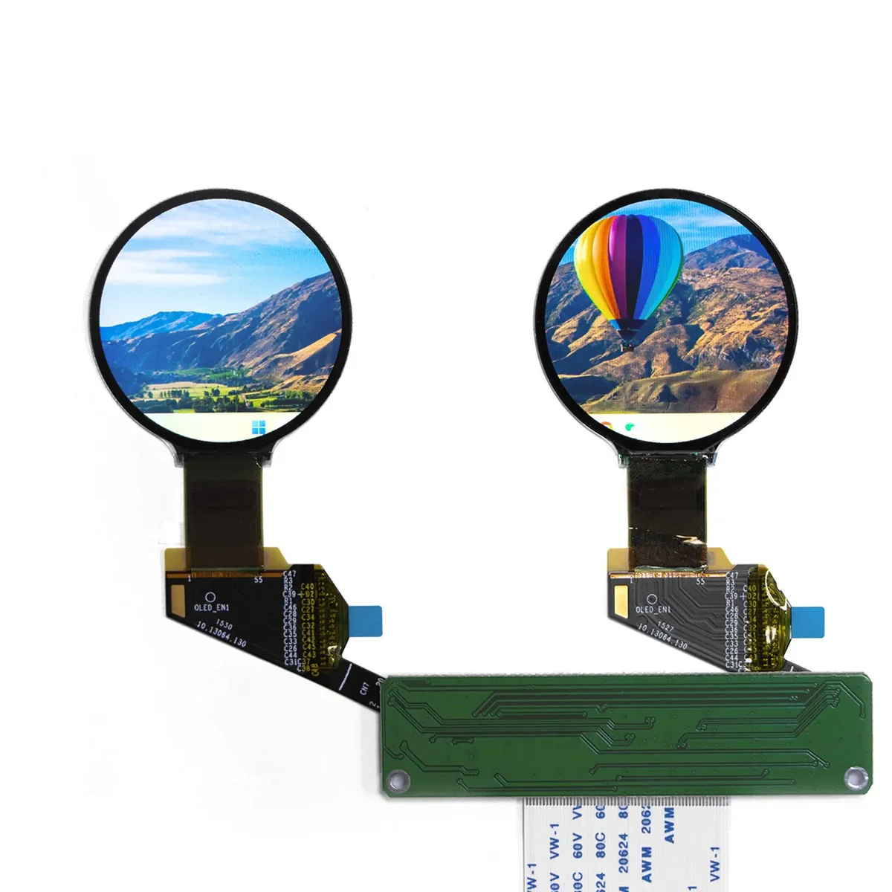
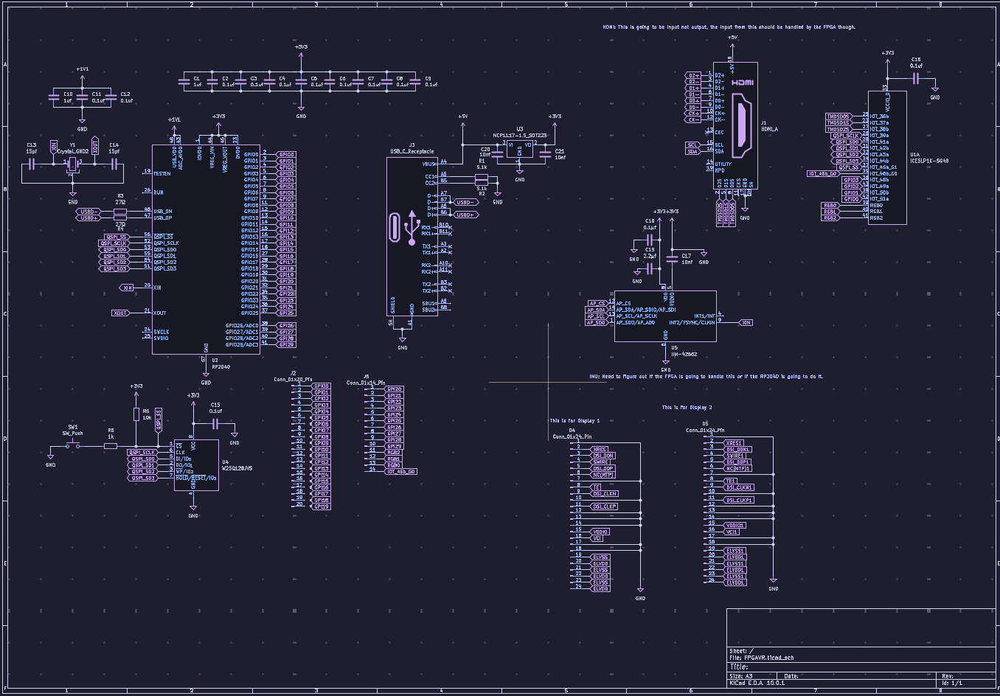

# September 10

My goal with this session is to do substantial research about exactly how to implement my ideas. The idea behind this project is to use an FPGA to take an input from a computer(Or have the "input" preprogrammed honestly I want it to be both). I will also have a RP2040 to handle usb inputs and various other background tasks I don't know enough about VR to understand. I am not sure how difficult it is to read/interpret outputs from an IMU so that is another reason for possibly using a RP2040 in addition to a FPGA. I will be structuring the project in a more specific way than I have in the past. This time I have a research folder with a [Resources.md](Research/Resources.md) . Another part of the project that I am not completely sure about is how to go from a 2D image to a 180 at least projection. I did some research into the sterographic photography. The problem with this is I still don't know exactly what I need to do. The reason I am being so broad with my research right now is that I want to get a good base for everything else that I need to do. After doing some more general research I am going to work on the schematic itself. . Another thing I need to take into account is, I need to a way to go from a hdmi input. When I was first researching it I originally thought that a TMDS encoder would work. However when I looked into it further I found that FRL is what HDMI 2.1 and beyond uses. I will probably have to account for that in the project. The problem is that, since this is an open source project I probably cannot use the FRL encoders. I will have to use a TMDS encoder as I found later.

- Recording link
https://lapse.hackclub.com/timelapse/FKwI7hJ7bjrV

**Total time spent: 1.57 hours**

# September 11

I found out about a project that should help with reverse engineering the TDMS signals from the input HDMI port (Get rid of anything after 4 mins). There will be lots of struggle with this part of the project I am predicting. I first struggled with trying to find a good example circuit doing exactly what I was trying to do.  I think that the verilog core generator for this should help tremendously with this. I also started to look at screens that would fit this application. I think that the minimum screen size for this would have to be 7 inches. The difficult thing is (Get rid of one at 59). I think that trying to split the screen in half and try to display slightly different images would be fairly difficult. As I was doing this I was also working on the Schematic I went through several iterations. Right now I think that it is incredibly flawed.  and .. This is the screen I was thinking about using for the VR headset. Overall, next time I need to investigate how I go from a 2D image to a sterographic image. I also need to try to fix the schematic.

Recording Links:
https://lapse.hackclub.com/timelapse/Nl5tw-8nKy2M
and hackatime

**Total Time Spent: 1.21 hours**

# September 14

I decided to work a little bit on the verilog part of the project a little bit. This should help me figure out exactly what to do. I still need to figure out exactly what I am trying to do. I decided to use AI this time to try to figure out exactly what I need to do. I am using it to mostly figure out if the way that I am doing my HDMI is accurate. I really don't think that it is anywhere close to being done. I also looked more closely and I found that I need to eventually set up how the FPGA is going to use memory. I was going to have it share the same memory as the RP2040. I really don't think that it will work properly though. Along with this I also decided to try to look for some screens so that I could figure out exactly how many io pins I would need from the FPGA for all of this to work. [These](https://www.displaymodule.com/products/1-39-inch-round-amoled-display-400x400-16-7m-colors-with-mipi) are the specific screens that I think would work. I would just need to find the footprints for it. Another thing that I decided to do is I decided to is to breakout the IO pins of both the RP2040 and the FPGA. I decided to do this because this will be a quite a unique PCB anyway so I think that even if this does not work it would still be work it to maybe try to bodge it. I also decided to start to add the displays to the mix. The thing is, for the vendor that I found I only found a pinout for a 24 pin variant. The problem is that the 24 pin variant of the screen is currently out of stock. The hope is that I will be able to find the alternative 20 pin pinout diagram so that I can use that. Or if the newer displays could come back which would also be nice. this is an image of the screen that I intend on using.  There is alot more work to. I am very confident that I miswired something. . I will be checking if this is nearly enough for this to work. In addition to all of this I also work more on the HDL portion. I will probably be spending a fair amount of time just trying to figure out how all of this works. I started with basic math pretty much. The hope is that it will not be this way soon.

Recording Links:
https://lapse.hackclub.com/timelapse/a-z0Tn7CU--3

**Total Time Spent: 1.01 hours**